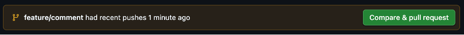
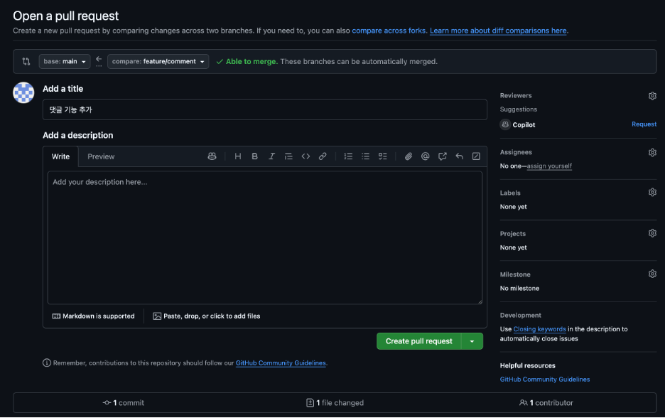
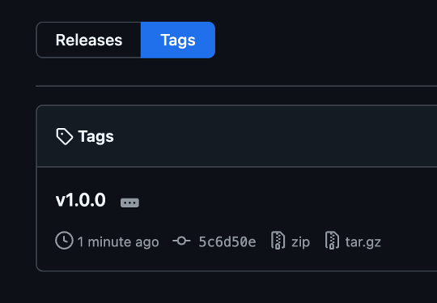

# Road to Developer.

## Chapter 00. git 기본

### CLI 기본 명령어

```
$ git init
```

- .git 폴더: local repository 생성
- 초기화 과정
- shift + command + . : 숨김 파일 확인

```
$ git config -- global user.email(.name) "email(name)"
```

- 수정자 정보 등록
- 이메일, 이름 입력

```
$ git add file
```

- 버전으로 만들 파일(변경할 사항) 선택

```
$ git commit -m
```

- 커밋의 상세 설명 추가

```
$ git log
```

- 커밋 확인 가능, 최신순

```
$ git checkout 7자리
```

- 이전 커밋으로 되돌아가기
- 7자리 대신 - 사용시 최신 커밋으로 복원
- 최근 switch, restore 명령어로 나뉘어짐
- switch: 브랜치 간 이동
- restore: 파일 복구
- checkout은 실무에서 사용하지 않음

```
$ git remote add origin 주소
```

- repository 생성 후 연결 (https://github.com/SJ-Kim-03/GithubLearn.git)
- 원격 저장소 주소 입력
- origin: 원격 저장소

```
$ git branch -M name of branch
```

- 저장될 branch 생성

```
$ git push origin main
```

- 원격 저장소의 branch에 업로드
- origin의 main이라는 branch로 올려라
- github에서 repository 생성 시 main 브랜치 생성이 default
- CLI, 코드트리 환경에서는 master 브랜치 생성, 변경 가능
- name, token 입력

```
$ git clone 원격 저장소 주소 .
```

- 로컬 저장소에 내려받기
- 띄우고 마침표 하지 않으면 리포지토리 이름 폴더가 생성됨

```
$ git pull origin main
```

- 다른 로컬 저장소에서 최신본 가져오기

## Chapter 01~02. GUI, 버전 관리

### 소스트리 설치

- Git 사용 도와주는 GUI
- Create: = git init 초기화 명령어
- Add: 로컬 저장소를 소스트리에 추가
- .git 폴더에는 버전 관리한 데이터와 원격 저장소 주소 등 정보 저장

### SubVersion(SVN)과 Git의 차이

- SVN: 델타(Delta) 방식, 차이점만 저장, 많은 계산 필요
- Git: 스냅샷(Snapshot) 방식, 전체 저장, 바로 앞 커밋과 비교연산 1회

### Git으로 관리하는 파일의 네 가지 상태

- ** 추적 안됨(untracked)**: git init, 초기화, 파일 생성
- ** 스테이지됨(staged)**: git add 파일명, 파일 스테이지에 올리기
- ** 수정 없음(unmodified)**: git commit -m "message", 스냅샷(버전) 생성
- 원격 저장소 업로드: git push origin main
- ** 수정함(modified)**: 파일 수정 or 생성한 경우, 수정 없음(unmodified)일 경우 스테이징 불가
- 변경사항 add, commit, push를 통해 버전 관리

## Chapter 03. 협업하기

### 브랜치

- commit 1 --- 2 --- 3 ..., 브랜치는 commit을 **'가리킨다'**
- 하나의 커밋을 여러 브랜치가 가리킬 수 있다.
- 다수가 개발 협업 시, 서로 "다른" 브랜치에 커밋, 이후 합치는 방식으로 협업
- 특정한 기준 시점에서 줄기를 나누어 작업할 수 있는 기능을 **브랜치**라고 함
- 분기 시 브랜치는 포인터(pointer) 역할을 하게 된다.
- **HEAD**라는 특수한 포인터 사용, 브랜치를 가리키게 하여 커밋 상태를 볼 수 있게 함
- HEAD로 인해 브랜치 간 왕래가 가능
- HEAD 포인터가 과거 커밋을 가리킬 경우, 분리된(Detached) HEAD라고 표현

### 협업 규칙 예시

- main 브랜치에는 직접 커밋하지 않는다.
- 기능 개발 전 main 브랜치 기준 새로운 브랜치 생성
- 브랜치명은 feature/기능 형식, 한 명만 커밋
- 개발 후 main 브랜치에 합치기

### 브랜치 생성

- 협업 규칙에 따라 새로운 브랜치 생성
- 생성 시 새 브랜치 체크아웃 체크, 생성과 동시에 해당 브랜치로 이동
- 체크 안하면 HEAD가 main 브랜치를 가리킨 상태 유지
- 소스트리 폴더/설명 상태로 보임, HEAD가 어떤 브랜치에 있는 지 확인 가능
- 소스트리에서 더블클릭 시 브랜치 이동 가능

### 체크아웃

- 브랜치를 이동하는 명령
- 브랜치 생성 시, 기준 되는 브랜치(ex. main) 잘 설정하기

### 병합

- 두 버전의 합집합 만들기, 3가지 경우
- 병합 커밋(merge commit): (A+x)+(A+y)=A+x+y
- 빨리 감기(fast-forward): A+(A+x)=A+x
- 충돌(conflict): (A+x)+(A+x')=x?orx'?
- 충돌 시 Vscode 상에서 <<<<<<< HEAD (Current Change) ~~~ >>>>>>> main (Incoming Change)가 표시, 확인 후 수정 필요
- 여러 브랜치에서 작업하던 것을 하나의 브랜치로 수렴되도록 하는 과정이 병합

### 풀 리퀘스트(pull request)

- 협력자에게 브랜치 병합을 요청하는 메시지를 보내는 것
- 새로운 브랜치 커밋, 푸시 후 github에서 compare % pull request 버튼 확인 가능
  
- base: 병합된 커밋이 들어갈 베이스 브랜치 설정
- compare: 병합이 될, 반영시킬 비교 브랜치 설정
- Able to merge: 병합 가능한 지 여부, 충돌 시 conflict 표시
- Add a title: 풀 리퀘스트 제목
- Add a description: 풀 리퀘스트 설명, 스크린샷 첨부 or 테스트 방법 등, 이미지 붙여넣기 가능
- Reviewers: 협력자가 여러명인 경우, 몇 명을 선택해 리뷰 요청 가능, 보통 같은 팀원 or 연관 동료
- Assingees: 풀 리퀘스트 담당 동료 지정, 보통 자기 자신
- Labels: 풀 리퀘스트 라벨, 예를 들어 [버그], [리뷰 필요], [프론트엔드], [벡엔드] 등
  
- 협력자는 풀 리퀘스트를 확인하고 검토 가능
- 코드 라인마다 댓글을 통해 토론 가능
- 수락(Accept), 수정 요청(Request change), 병합(Merge pull request) 가능
- 완료 후, 소스트리(10분 간격으로 자동 패치)에서 패치(fetch) 후 main 브랜치에서 로컬 저장소 반영(pull)

### 릴리즈(Release), 출시

- 프로그램 출시(Release), 업그레이드 시 '버전(version)'을 명시 (ex. v19.13.2)
- 이는 메이저(major), 마이너(minor), 메인터넌스(maintenance) 버전으로 나뉨
- 메이저: 사용자들이 크게 느낄 변화 적용
- 마이너: 사용자들이 느낄 작은 변화 적용
- 메인터넌스: 버그나 유지 보수 등 작은 수정 시
- LTS(Long Time Support): 장기 지원 버전, 일반 버전보더 장기간 걸쳐 지원
- 릴리즈 시 태그(tag) 표시 가능, 간단하게 버전 표시, 소스트리에서 입력 가능
- 태그 또한 커밋을 가리키는 포인터, 푸시(push all tag 체크)를 통해 원격 저장소에 적용 가능
- 원격 저장소에서 해당 버전을 압축 파일로 다운 가능
  
